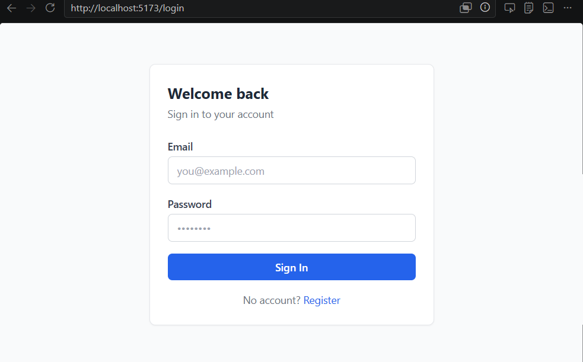
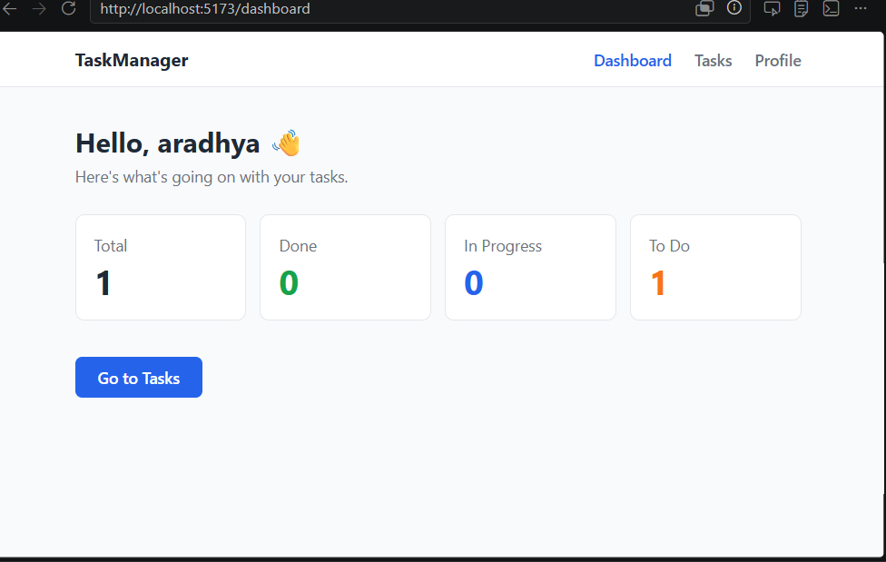
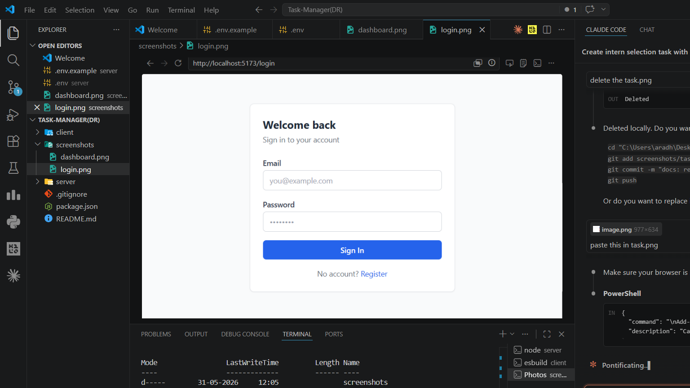

# Task Manager App

A full-stack Task Manager built with React + Node.js. Users can register, log in, and manage tasks with priorities, statuses, and due dates.

---

## Tech Stack

- **Frontend:** React 18, React Router v6, Tailwind CSS, Axios
- **Backend:** Node.js, Express.js, MongoDB (Mongoose)
- **Auth:** JWT (jsonwebtoken), bcrypt
- **Security:** Helmet, CORS, express-rate-limit, Joi validation

---

## Screenshots





---

## Local Setup

### 1. Clone the repo

```bash
git clone <your-repo-url>
cd task-manager
```

### 2. Install dependencies

```bash
cd server && npm install
cd ../client && npm install
```

### 3. Configure environment variables

```bash
cd server
cp .env.example .env
```

Edit `server/.env` with your values:

```
PORT=5000
MONGO_URI=mongodb+srv://<username>:<password>@cluster0.xxxxx.mongodb.net/taskmanager?appName=Cluster0
JWT_SECRET=your_long_random_secret_key
JWT_EXPIRES_IN=7d
CLIENT_URL=http://localhost:5173
```

### 4. Run the app

Open **two terminals**:

**Terminal 1 — Backend:**
```bash
cd server
npm run dev
```

**Terminal 2 — Frontend:**
```bash
cd client
npm run dev
```

Open: `http://localhost:5173`

---

## Environment Variables

| Variable | Description |
|---|---|
| `PORT` | Port the server runs on (default: 5000) |
| `MONGO_URI` | MongoDB Atlas connection string |
| `JWT_SECRET` | Secret key for signing JWT tokens |
| `JWT_EXPIRES_IN` | Token expiry (e.g. `7d`) |
| `CLIENT_URL` | Frontend URL for CORS |

---

## API Endpoints

### Auth
| Method | Endpoint | Auth | Description |
|---|---|---|---|
| POST | `/api/auth/register` | No | Register new user |
| POST | `/api/auth/login` | No | Login, returns JWT |
| POST | `/api/auth/logout` | JWT | Logout and invalidate token |

### Tasks (all protected)
| Method | Endpoint | Description |
|---|---|---|
| GET | `/api/tasks` | Get all tasks for logged-in user |
| POST | `/api/tasks` | Create a new task |
| PATCH | `/api/tasks/:id` | Update a task |
| DELETE | `/api/tasks/:id` | Delete a task |

---

## Features

- Register and login with JWT authentication
- Dashboard with task stats (total, done, in-progress, todo)
- Create, edit, delete tasks via modal
- Filter tasks by status (All / Todo / In-Progress / Done)
- Priority badges (Low = green, Medium = orange, High = red)
- Loading skeletons while data loads
- Toast notifications on task create / update / delete
- Empty state message when no tasks exist
- Fully responsive (mobile + desktop)
- Protected routes redirect unauthenticated users to /login
